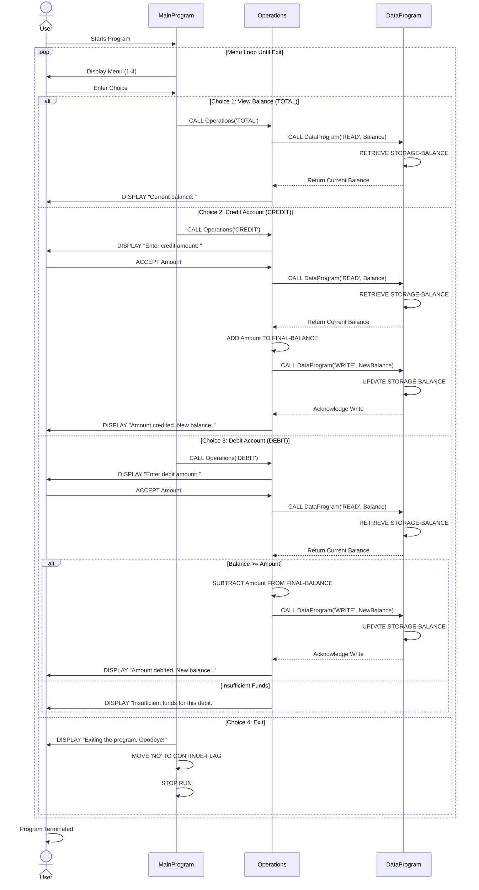
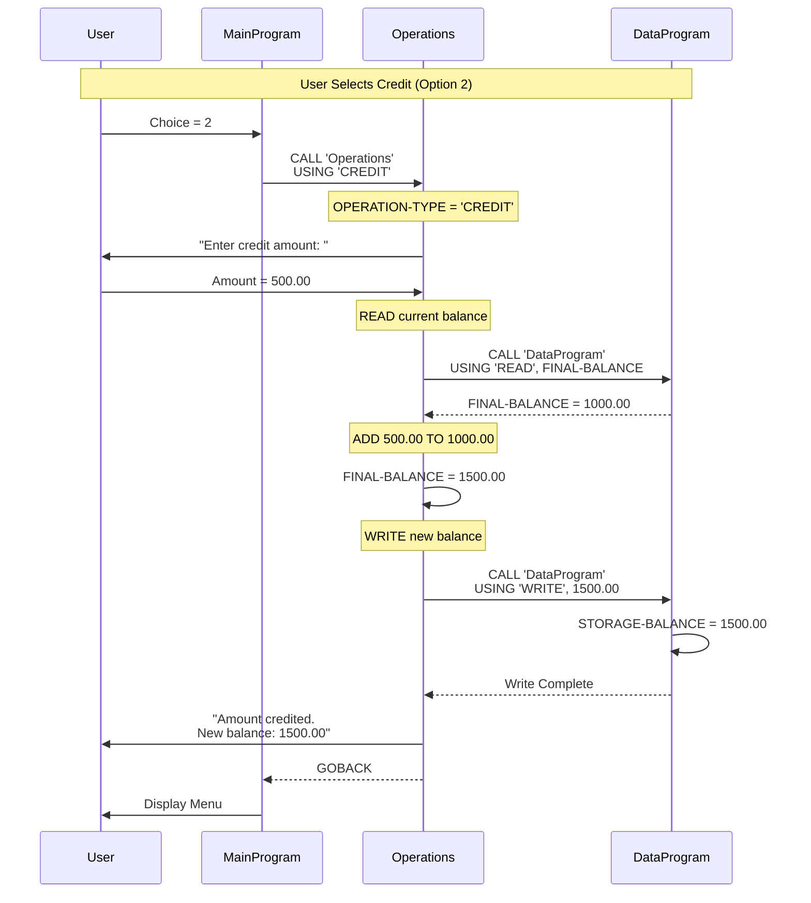
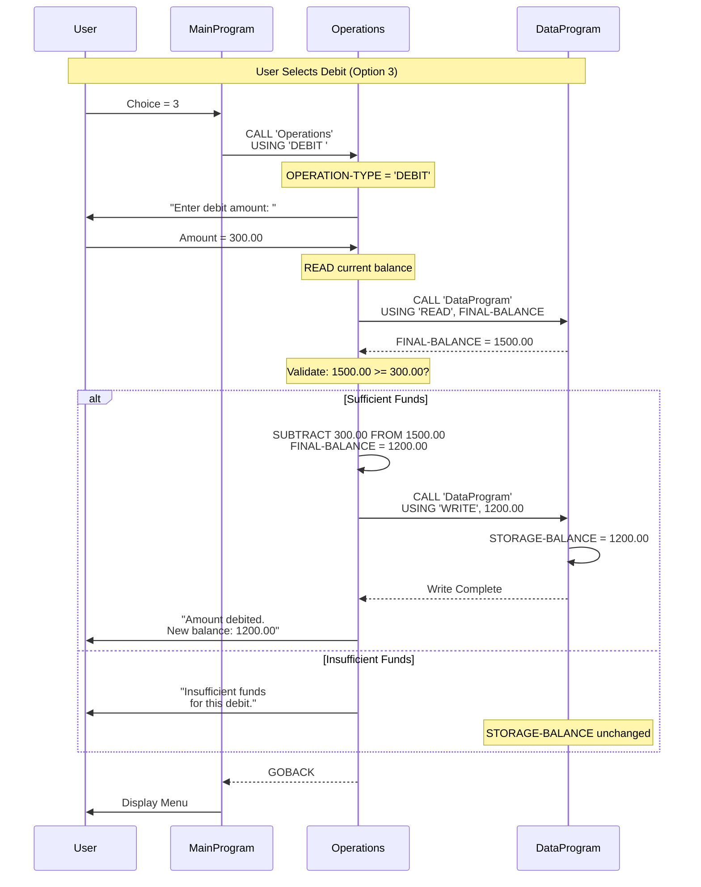

# COBOL Student Account Management System - Documentation

## Overview

This documentation covers the COBOL-based Account Management System designed for managing student account operations including balance inquiries, credit transactions, and debit transactions.

---

## File Structure

### 1. **main.cob** (MainProgram)

**Purpose:** Entry point and user interface for the Account Management System.

**Key Responsibilities:**
- Displays an interactive menu-driven interface
- Accepts user input for account operations
- Routes user selections to appropriate operations
- Manages program flow and continuation

**Key Functions:**
- **MAIN-LOGIC**: Implements a loop that continues until user selects 'Exit'
- Menu options:
  1. View Balance (calls Operations with 'TOTAL')
  2. Credit Account (calls Operations with 'CREDIT')
  3. Debit Account (calls Operations with 'DEBIT')
  4. Exit (terminates program)

**Data Structure:**
```
USER-CHOICE      (PIC 9): Stores user's menu selection
CONTINUE-FLAG    (PIC X(3)): Controls loop continuation ('YES'/'NO')
```

---

### 2. **data.cob** (DataProgram)

**Purpose:** Data persistence layer responsible for managing account balance storage and retrieval.

**Key Responsibilities:**
- Maintains account balance in working storage
- Provides READ/WRITE operations for balance data
- Acts as the single source of truth for account balance

**Key Functions:**
- **READ Operation**: Retrieves current account balance from STORAGE-BALANCE
- **WRITE Operation**: Updates STORAGE-BALANCE with new balance value

**Data Structure:**
```
STORAGE-BALANCE  (PIC 9(6)V99): Persistent account balance (initial: 1000.00)
OPERATION-TYPE   (PIC X(6)): Determines READ or WRITE operation
PASSED-OPERATION (PIC X(6)): Operation type passed from calling program
BALANCE          (PIC 9(6)V99): Balance value exchanged via linkage section
```

---

### 3. **operations.cob** (Operations)

**Purpose:** Business logic layer handling account transaction operations.

**Key Responsibilities:**
- Implements transaction processing (total, credit, debit)
- Validates transaction constraints
- Manages communication between main program and data layer
- Handles user input for transaction amounts

**Key Functions:**

- **TOTAL Operation**: 
  - Reads current balance from DataProgram
  - Displays balance to user

- **CREDIT Operation**:
  - Prompts user for credit amount
  - Reads current balance
  - Adds amount to balance
  - Writes updated balance to data layer
  - Confirms transaction with new balance

- **DEBIT Operation**:
  - Prompts user for debit amount
  - Reads current balance
  - Validates sufficient funds (balance >= amount)
  - If valid: Subtracts amount and writes updated balance
  - If insufficient: Displays error message
  - Confirms transaction or error status

**Data Structure:**
```
OPERATION-TYPE    (PIC X(6)): Type of operation ('TOTAL ', 'CREDIT', 'DEBIT ')
AMOUNT            (PIC 9(6)V99): Transaction amount (input from user)
FINAL-BALANCE     (PIC 9(6)V99): Current account balance (initial: 1000.00)
PASSED-OPERATION  (PIC X(6)): Operation type passed from main program
```

---

## Business Rules

### Student Account Rules

1. **Initial Balance**: All accounts begin with a balance of **1000.00**

2. **Credit Transactions**:
   - Any positive amount can be credited to the account
   - No upper limit is enforced
   - Balance is immediately updated in persistent storage

3. **Debit Transactions**:
   - Users can only debit amounts that do not exceed current balance
   - **Overdraft Protection**: System prevents insufficient funds errors
   - Transaction is rejected if balance < requested debit amount
   - Balance remains unchanged on failed debit attempt

4. **Balance Inquiry**:
   - Users can view current balance at any time
   - Balance reflects all previous transactions

5. **Transaction Flow**:
   - All transactions follow: Read → Validate/Modify → Write pattern
   - Data consistency is maintained through single data layer
   - No concurrent transaction handling (sequential processing only)

6. **User Constraints**:
   - Menu-driven interface with input validation
   - Invalid menu selections are rejected with error message
   - Users must explicitly exit; no automatic timeout

---

## Program Flow Diagram

```
MainProgram (UI)
    ↓
[Display Menu & Accept User Choice]
    ↓
    ├─→ Choice 1 → Operations (TOTAL)
    │       ↓
    │   DataProgram (READ)
    │       ↓
    │   Display Balance
    │
    ├─→ Choice 2 → Operations (CREDIT)
    │       ↓
    │   DataProgram (READ)
    │       ↓
    │   Add Amount
    │       ↓
    │   DataProgram (WRITE)
    │       ↓
    │   Display New Balance
    │
    ├─→ Choice 3 → Operations (DEBIT)
    │       ↓
    │   DataProgram (READ)
    │       ↓
    │   Validate Sufficient Funds
    │       ↓
    │   [If Valid] Subtract Amount + DataProgram (WRITE)
    │   [If Invalid] Display Error
    │       ↓
    │   Display Result
    │
    └─→ Choice 4 → Exit Program
```

---

## Technical Notes

- **Data Persistence**: Balance is stored in COBOL working storage and remains in memory during program execution
- **Decimal Handling**: All amounts use COMP-3 or display numeric format (6 digits + 2 decimal places)
- **Linkage Section**: Communication between programs uses the linkage section for parameter passing
- **Error Handling**: Limited to insufficient funds validation for debit operations
- **No External Files**: All data is maintained in memory; no database or file I/O

---

## Future Modernization Considerations

- Migrate from menu-driven UI to web/API interface
- Implement database persistence instead of in-memory storage
- Add comprehensive transaction logging and audit trails
- Implement multi-user support with concurrency control
- Add authentication and authorization
- Refactor into microservices architecture
- Implement unit testing and automated validation

---

## Sequence Diagrams

### Complete Data Flow - All Operations

The following sequence diagram shows the complete data flow for all account operations:



### Data Flow for Credit Transaction (Detailed)

This diagram focuses on the credit transaction flow with data values:



### Data Flow for Debit Transaction (Detailed)

This diagram focuses on the debit transaction flow with validation:


